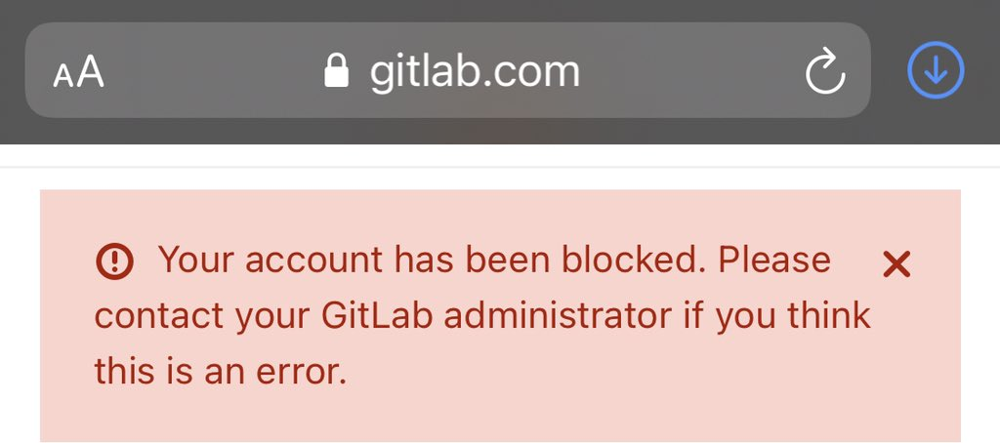
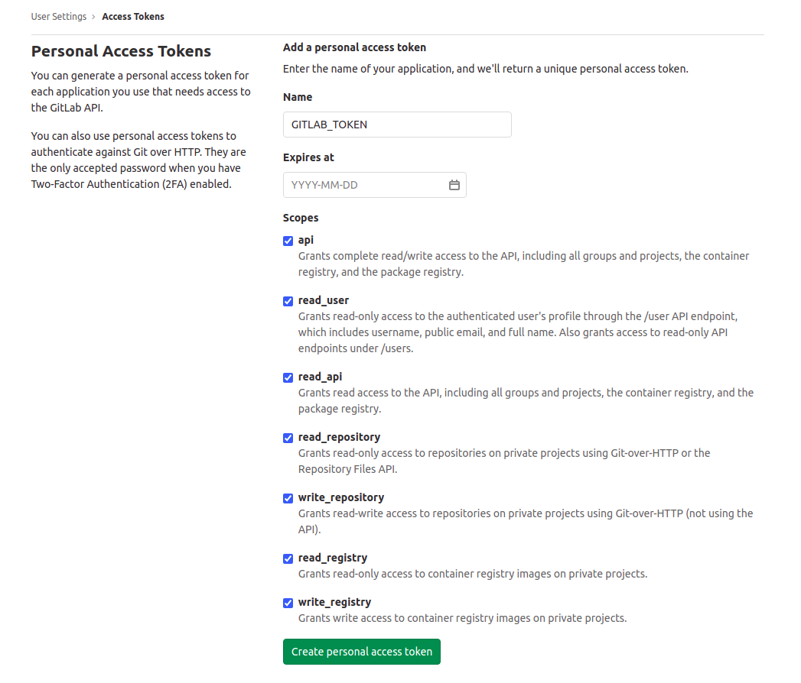
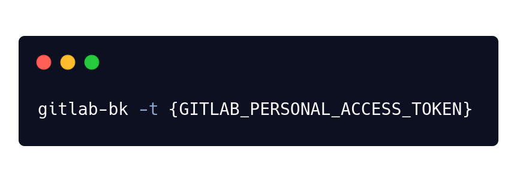

&nbsp;&nbsp;&nbsp;&nbsp;&nbsp;&nbsp;&nbsp;&nbsp;&nbsp;&nbsp;&nbsp;&nbsp;&nbsp;&nbsp;&nbsp;&nbsp;&nbsp;&nbsp;&nbsp;
![Python][python-shield]
[![GitHub Issues][issues-shield]][issues-url]
![Contributions welcome][contributions-sheild]
[![License][license-shield]][license-url]

<!-- PROJECT LOGO -->
<br />
<p align="center">
  <a href="https://github.com/SinaKarimi7/Gitlab-Backup">
    
  </a>

  <h3 align="center">Gitlab Backup Tool</h3>

  <p align="center">
    Clone all projects in Gitlab account by group at once.
    <br />
   <a href="https://github.com/SinaKarimi7/Gitlab-Backup/issues">Report Bug</a>
    ·
    <a href="https://github.com/SinaKarimi7/Gitlab-Backup/issues">Request Feature</a>
  </p>
</p>

<!-- TABLE OF CONTENTS -->

## Table of Contents

- [About](#about-the-project)
- [Getting Started](#getting-started)
  - [Prerequisites](#prerequisites)
  - [Installation](#installation)
- [Usage](#usage)
- [License](#license)
- [Contact](#contact)

<!-- ABOUT THE PROJECT -->

## TLDR; The last stand before sanctions...

<a href="https://twitter.com/haghighi_ahmad/status/1314149428920553473?s=20">
    
    <br/>
    <br/>
    <blockquote class="twitter-tweet"><p lang="en" dir="ltr">Five days ago <a href="https://twitter.com/hashtag/gitlab?src=hash&amp;ref_src=twsrc%5Etfw">#gitlab</a> blocked <a href="https://twitter.com/hashtag/Iranians?src=hash&amp;ref_src=twsrc%5Etfw">#Iranians</a>’ access without prior notice! and today we faced with a BIG surprise from GitLab! Blocking our Accounts! <a href="https://twitter.com/hashtag/discrimination?src=hash&amp;ref_src=twsrc%5Etfw">#discrimination</a> <a href="https://t.co/7Dk6E8Yo0L">pic.twitter.com/7Dk6E8Yo0L</a></p>&mdash; Ahmad Haghighi (@haghighi_ahmad) <a href="https://twitter.com/haghighi_ahmad/status/1314149428920553473?ref_src=twsrc%5Etfw">October 8, 2020</a></blockquote>
</a>

In last days, `GitLab` has decided to **block** Iranian accounts from _contributing_ and being part of the **open-source** ecosystem.<br/>
They didn't send any messages before this decision and our codes and projects have been locked!<br/>
<br/>

> "Although we understand GitLab might make this decision under the pressure of the US government, we were expecting a more respectful action from GitLab.

**GitLab blocked our access to private repositories suddenly, but at the very least we wanted GitLab to warn us before limiting our access.**

**GitLab decided to take one step further and ban every user that used Iran's IP address somewhere their history no matter where she/he is living, while they could just restrict access by IP address like other US-based companies. This action is a kind of ban by nationality.**

_Let us **download** our private repositories and gists and also make them public (setting control)._

Some text above belong here but repeated again:
https://github.com/1995parham/github-do-not-ban-us

<!-- GETTING STARTED -->

## Getting Started

You just get the GitLab token and put in this script.

### Prerequisites

This tool wrote in python language, so it needs:

- python3 or above (with pip)

### Installation

```sh
$ pip install gitlab-bk
```

<!-- USAGE EXAMPLES -->

## Usage

At first, you have to get `GITLAB_PERSONAL_ACCESS_TOKEN` from [here](https://gitlab.com/profile/personal_access_tokens).

> Ensure to check all scopes.

<a href="https://gitlab.com/profile/personal_access_tokens">
    
</a>

_For more examples, please refer to the [GitLab Official Documentation](https://docs.gitlab.com/ee/user/profile/personal_access_tokens.html)._

Then run script:

<p align="center">
    
</p>

You can use with advanced options:

```
Usage: gitlab-bk [-t str] [--verbose] [-u str] [-o str] [-m str] [-v] [-h]

Gitlab backup tool, clone all project at once!

Required arguments:
  -t str, --token str   Gitlab personal access token

Optional arguments:
  --verbose             Enable verbose output
  -u str, --url str     Specify Gitlab instance URL
  -m str, --method str  Specify clone method (default is "http")
  -o str, --output str  Output directory (default is "./gitlab-backup")
  -v, --version         Show program's version number and exit
  -h, --help            Show this message and exit.
```

<!-- LICENSE -->

## License

Distributed under the MIT License. See `LICENSE` for more information.

<!-- CONTACT -->

## Contact

The easiest way to contact me is by sending me an [email](mailto:sinakarimi76@gmail.com). But you have
several other options available, too.

[![Twitter][twitter-shield]][twitter-url]
[![Linkedin][linkedin-shield]][linkedin-url]
[![Telegram][telegram-shield]][telegram-url]
[![Instagram][instagram-shield]][instagram-url]

<!-- MARKDOWN LINKS & IMAGES -->

[twitter-shield]: https://img.shields.io/twitter/follow/sinakarimi76?link=https://twitter.com/sinakarimi76&logo=twitter&color=1da1f2&style=for-the-badge
[twitter-url]: https://twitter.com/sinakarimi76
[linkedin-shield]: https://img.shields.io/static/v1?link=https://linkedin.com/in/sinakarimi7&logo=linkedin&label=Linkedin&message=%20&style=for-the-badge
[linkedin-url]: https://linkedin.com/in/sinakarimi7
[telegram-shield]: https://img.shields.io/static/v1?link=https://t.me/s/sinakarimi7&logo=telegram&label=Telegram&message=%20&color=2ca5e0&style=for-the-badge
[telegram-url]: https://t.me/s/sinakarimi7
[instagram-shield]: https://img.shields.io/static/v1?link=https://instagram.com/sinakarimi7&logo=instagram&label=Instagram&message=%20&color=e4405f&style=for-the-badge
[instagram-url]: https://instagram.com/sinakarimi7
[stars-shield]: https://img.shields.io/github/stars/SinaKarimi7/Gitlab-Backup.svg?style=flat-square
[stars-url]: https://github.com/SinaKarimi7/Gitlab-Backup/stargazers
[issues-shield]: https://img.shields.io/github/issues/SinaKarimi7/Gitlab-Backup.svg?style=flat-square
[issues-url]: https://github.com/SinaKarimi7/Gitlab-Backup/issues
[license-shield]: https://img.shields.io/badge/license-MIT-blue.svg?style=flat-square
[license-url]: https://opensource.org/licenses/MIT
[contributions-sheild]: https://img.shields.io/badge/contributions-welcome-orange.svg?style=flat-square
[python-shield]: https://img.shields.io/badge/python-v3.6+-blue.svg?style=flat-square
